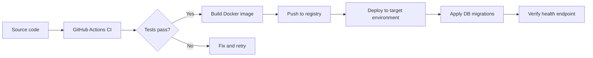

# Deployment Procedures

High-level guide for building, testing, and deploying Product API.

---

## Deployment overview



---

## 1. Continuous integration

Workflow: `.github/workflows/build.yml`

**Triggers:** Push or pull request to `main`

**Steps:**

1. Checkout code
2. Install .NET 9.0 SDK
3. `dotnet restore`
4. `dotnet build --no-restore`
5. `dotnet test --no-build`

CI validates compile and test success. It does **not** build Docker images or deploy automatically.

> **Note:** The repository default branch may be `master`. Update workflow branch filters or rename the branch so CI runs on your main branch.

---

## 2. Build the Docker image

From the solution root:

```bash
docker build -t product-api:latest .
```

The multi-stage `Dockerfile`:

1. **Build stage** — `dotnet/sdk:9.0`, restore and publish `src/API/API.csproj`
2. **Runtime stage** — `dotnet/aspnet:9.0`, exposes port **8080**

Verify locally:

```bash
docker run -p 8080:8080 \
  -e ConnectionStrings__DefaultConnection="Server=host.docker.internal,1433;..." \
  -e Jwt__SecretKey="your-production-secret" \
  product-api:latest
```

---

## 3. Deploy with Docker Compose

For environments that run API + SQL Server together:

```bash
docker compose up -d --build
```

Services defined in `docker-compose.yml`:

| Service | Image | Port |
|---------|-------|------|
| `api` | Built from Dockerfile | 8080 |
| `sqlserver` | `mcr.microsoft.com/mssql/server:2022-latest` | 1433 |

Persistent SQL data is stored in the `sqlserver-data` volume.

---

## 4. Production configuration

Set secrets via environment variables — do **not** rely on committed `appsettings.json` values.

| Variable | Purpose |
|----------|---------|
| `ASPNETCORE_ENVIRONMENT` | `Production` |
| `ASPNETCORE_URLS` | `http://+:8080` |
| `ConnectionStrings__DefaultConnection` | Production SQL connection |
| `Jwt__SecretKey` | Strong signing key (32+ characters) |
| `Jwt__Issuer` | Token issuer |
| `Jwt__Audience` | Token audience |
| `Jwt__ExpiryMinutes` | Token lifetime |

Example (Docker):

```bash
docker run -d \
  -p 8080:8080 \
  -e ASPNETCORE_ENVIRONMENT=Production \
  -e ConnectionStrings__DefaultConnection="Server=..." \
  -e Jwt__SecretKey="..." \
  product-api:latest
```

---

## 5. Database migrations

Migrations are **not** applied automatically on startup. Run before or after deployment:

```bash
dotnet ef database update \
  --project src/Infrastructure/Infrastructure.csproj \
  --startup-project src/API/API.csproj \
  --connection "YOUR_PRODUCTION_CONNECTION_STRING"
```

Ensure the migration history is backed up and tested in a staging environment first.

---

## 6. Post-deployment verification

| Check | Command / URL |
|-------|---------------|
| Health | `GET /health` → `200 OK` |
| Swagger | `/swagger` (consider disabling in production) |
| Login | `POST /api/v1/auth/login` |
| Protected route | `POST /api/v1/products` with Bearer token |
| Logs | Console / file sink (`logs/product-api-*.log`) |

---

## 7. Container registry (optional)

Tag and push to your registry:

```bash
docker tag product-api:latest myregistry.azurecr.io/product-api:1.0.0
docker push myregistry.azurecr.io/product-api:1.0.0
```

Deploy the tagged image on Azure App Service, AWS ECS, Kubernetes, or any container host that supports .NET 9 ASP.NET Core runtime images.

---

## 8. Production recommendations

- Use a secrets manager (Azure Key Vault, AWS Secrets Manager, etc.) for connection strings and JWT keys.
- Restrict Swagger UI to non-production environments.
- Enable HTTPS termination at the load balancer or reverse proxy.
- Configure SQL Server firewall and least-privilege DB accounts.
- Set up log aggregation for Serilog file/console output.
- Extend CI to build and push Docker images on release tags.

---

## Related files

| File | Purpose |
|------|---------|
| `Dockerfile` | Multi-stage API image |
| `docker-compose.yml` | Local/staging stack (API + SQL) |
| `.dockerignore` | Excludes build artifacts from context |
| `.github/workflows/build.yml` | CI build and test |
